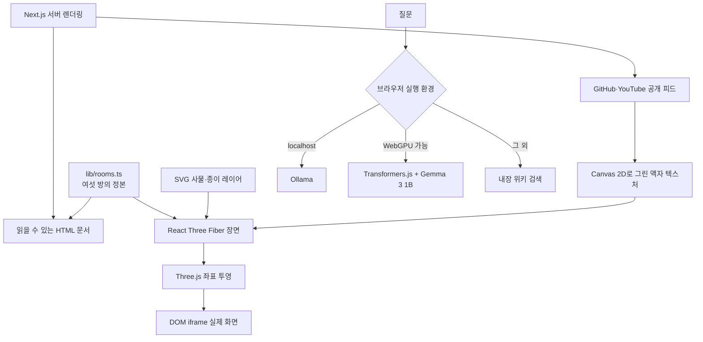

# 2DROOM-AING

> 읽을 때는 명확한 경력 문서, 둘러볼 때는 직접 걸어 들어가는 종이 복도.

**2DROOM-AING**은 풀스택 개발자 박상욱(iron)의 경력과 작업 방식을 여섯 개의 방으로 구성한 인터랙티브 포트폴리오입니다.

기본 화면에서는 의료관광 서비스의 환자용 웹, 운영자 화면, 백엔드 사례를 빠르게 읽을 수 있습니다. 방문자가 원하면 `3D 복도 둘러보기`로 전환해 휠·터치·키보드로 복도를 걷고, 각 방의 사물과 실제 동작하는 화면을 직접 확인할 수 있습니다.

이 프로젝트의 핵심은 3D 자체가 아닙니다. **읽어야 하는 정보는 HTML로 남기고, 공간 경험만 WebGL에 맡기는 것**입니다.

## 무엇을 보여 주는가

복도에는 다음 여섯 개의 방이 있습니다.

| 방 | 내용 | 대표 근거 |
|---:|---|---|
| 1 | 앱 설치 없이 결제하는 글로벌 웹 | 14개 언어 · 9개월 운영 · 웹 0→1 |
| 2 | 운영자용 관리 화면 | 15명 협업 · 권한과 공통 UI 일원화 |
| 3 | 장애가 번지지 않는 서버 | 외부 연동 43곳 격리 · 쿠폰 검증 101건 |
| 4 | 공공 시스템·앱·실시간 통역 | 2019년부터 이어진 프로젝트 경험 |
| 5 | 직접 만든 캐릭터와 에셋 | 표정 16 · 액션 16 · 모션 6 · GLB 2 |
| 6 | 팀이 함께 쓰는 개발 도구 | 반복 작업을 줄이는 도구 검증과 공유 |

여섯 방을 모두 읽은 뒤에는 Codex와 Claude가 협업 기록에서 관찰한 평가를 공개합니다. 강점만 인용하지 않고, 선제 설계의 비용·위임 병목·완결성과 출시 속도의 균형 같은 잠재적 리스크도 함께 보여 줍니다.

## 두 가지 관람 방식

### 한눈에 보기

사이트의 기본 모드입니다. 검색엔진, 보조기기, 3D를 사용하지 않는 브라우저에서도 경력 전체를 읽을 수 있도록 본문을 서버에서 HTML로 렌더링합니다.

- 핵심 사례 3개를 `문제 → 내 역할 → 확인된 결과` 순서로 먼저 제시
- 전체 경력, 실제 화면 링크, GitHub, YouTube, 연락처 제공
- 모바일과 데스크톱에서 같은 콘텐츠 순서 유지
- 3D 없이도 완결되는 포트폴리오

### 3D 복도 둘러보기

선택형 공간 경험입니다. 스크롤을 페이지 이동 대신 카메라의 걸음으로 바꾸고, 문에 가까워지면 해당 사례로 들어갈 수 있습니다.

- 휠·트랙패드·터치·드래그를 하나의 이동 입력으로 통합
- 방향키·Page Up/Down·Space 키보드 이동 지원
- 문에 가까워질수록 카메라가 자연스럽게 해당 방향을 바라봄
- 방 안 사물을 누르면 HTML 설명 카드 표시
- 복도 끝까지 이동하면 연락처와 최신 작업 공개

## 어떻게 만들었는가



### 1. 콘텐츠를 먼저 만들고 3D를 얹었습니다

본문은 [app/page.tsx](app/page.tsx)에서 서버 렌더링됩니다. 3D 캔버스가 늦게 로드되거나 WebGL이 동작하지 않아도 이름, 경력, 사례, 연락처는 HTML에 그대로 남습니다.

3D 월드와 채팅 UI는 `next/dynamic`으로 분리해 서버의 첫 HTML 생성을 막지 않습니다. 읽기 모드에서는 WebGL 컨텍스트를 폐기하지 않고 R3F의 `frameloop`만 멈춰, 다시 복도로 돌아올 때 셰이더와 장면을 재생성하는 비용을 줄였습니다.

### 2. 3D처럼 보이지만 대부분은 손으로 그린 2D입니다

복도와 방은 Three.js 평면으로 구성합니다. 환경용 3D 모델과 실시간 조명을 사용하지 않고, 색과 그림자를 미리 그린 종이 레이어를 평면 텍스처로 배치했습니다.

- 방 안 사물: SVG 문자열 → Data URI → Three.js 텍스처
- GitHub·YouTube 액자: Canvas 2D 합성 → `THREE.CanvasTexture`
- 공간: 바닥·천장·벽·방을 단순한 plane geometry로 구성
- 결과: 작은 장면 구조, 일관된 종이 디오라마 스타일, 예측 가능한 성능

마스코트 킷에는 GLB 모델도 포함되어 있지만, 현재 복도 환경은 평면 중심의 규칙을 유지합니다.

### 3. 스크롤을 카메라 이동으로 바꿨습니다

[components/world/useCorridorCamera.ts](components/world/useCorridorCamera.ts)는 GSAP Observer로 `wheel`, `touch`, `pointer` 입력을 받아 하나의 전진 거리로 바꿉니다.

React Three Fiber의 `useFrame`에서 목표 위치를 감쇠 보간하고, 포인터 위치와 가까운 문의 방향을 카메라 회전에 반영합니다. 방에 들어가고 나오는 동작은 GSAP timeline이 담당하며, 애니메이션이 끝난 위치를 다시 스크롤 카메라의 기준점으로 넘깁니다.

### 4. 3D 모니터 위에 진짜 웹 화면을 올렸습니다

방 안 모니터는 단순한 스크린샷이 아닙니다.

1. Three.js가 모니터 네 모서리의 월드 좌표를 화면 좌표로 투영합니다.
2. React가 계산된 사각형 위치에 DOM `iframe`을 배치합니다.
3. CSS `transform`으로 원래 설계 해상도를 유지한 채 모니터 크기에 맞춥니다.
4. `크게 보기`를 누르면 같은 iframe을 뷰포트의 90%까지 확대합니다.

따라서 3D 공간의 일부처럼 보이면서도 실제 링크, 스크롤, 클릭이 동작합니다. iframe은 `loading="lazy"`로 필요한 방에 들어갔을 때만 로드합니다.

### 5. 브라우저 안에서 답하는 아잉을 만들었습니다

아잉 채팅은 질문과 포트폴리오 지식을 외부 AI API로 보내지 않습니다. 가능한 실행 경로를 순서대로 선택합니다.

| 우선순위 | 엔진 | 동작 |
|---:|---|---|
| 1 | Ollama | `localhost`에서 실행 중인 모델이 있으면 스트리밍 응답 사용 |
| 2 | WebGPU | Transformers.js와 Gemma 3 1B q4f16을 Web Worker에서 실행 |
| 3 | 내장 위키 | WebGPU가 없거나 모델이 실패하면 관련 문장을 검색해 즉시 답변 |

기본 온디바이스 모델은 약 763MB이므로 페이지 진입과 동시에 받지 않습니다. 사용자가 채팅을 열거나 입력할 의도를 보였을 때만 다운로드하며, 데이터 절약 모드·느린 회선·WebGPU 미지원 환경에서는 다운로드하지 않습니다.

생성은 메인 스레드가 아닌 모듈 Web Worker에서 실행합니다. 토큰은 `postMessage`로 스트리밍하고, 모델 OOM·디바이스 손실·탭 스로틀링에 대비해 타임아웃과 위키 폴백을 둡니다.

### 6. 최신 작업은 배포 이후에도 갱신됩니다

최근 YouTube 영상과 GitHub 저장소만 외부 공개 데이터를 사용합니다. Next.js `fetch`의 `revalidate`를 6시간으로 설정해 정적 프리렌더링을 유지하면서 최신 목록을 갱신합니다.

외부 서비스가 실패해도 페이지 빌드는 중단하지 않습니다. 해당 목록만 비우고 빌드 로그에 원인을 남기며, 본문과 연락처는 항상 렌더링합니다.

## 사용한 브라우저 기술

| 브라우저 기술 | 이 프로젝트에서 하는 일 |
|---|---|
| WebGL | Three.js가 복도, 방, 평면 텍스처를 GPU로 렌더링 |
| WebGPU | Transformers.js가 Gemma 3 1B ONNX 모델을 브라우저에서 추론 |
| Canvas 2D API | GitHub·YouTube 액자의 그림, 글자, 썸네일을 하나의 텍스처로 합성 |
| Web Worker | 온디바이스 LLM 로드와 생성을 메인 UI 스레드에서 격리 |
| DOM / HTML | 모든 경력 본문, 설명 패널, 접근 가능한 조작부 렌더링 |
| iframe | 방 안 모니터에서 실제 ZIVO 화면 실행 |
| CSS Transforms | 3D에서 투영한 모니터 좌표에 iframe과 마스코트를 정렬 |
| Pointer·Wheel·Touch Events | 마우스, 트랙패드, 터치를 복도 이동으로 통합 |
| Keyboard Events | 방향키, Page Up/Down, Space, Enter, Escape 조작 지원 |
| Fetch API | GitHub API, YouTube 공개 페이지, 로컬 Ollama 통신 |
| ReadableStream·TextDecoder | Ollama NDJSON 스트리밍 응답을 토큰 단위로 표시 |
| `matchMedia` | `prefers-reduced-motion`, `prefers-reduced-data` 사용자 설정 반영 |
| Network Information API | 데이터 절약 모드와 느린 연결에서 대용량 모델 다운로드 방지 |
| Responsive CSS | Grid, `clamp()`, `100svh`, `color-mix(in oklab, …)`로 반응형 종이 UI 구성 |
| Browser Cache | Transformers.js가 받은 모델을 재방문 시 다시 사용 |

복도는 WebGL, 아잉의 온디바이스 AI는 WebGPU를 사용합니다. 둘은 목적과 실패 방식이 다르므로 같은 기능으로 묶지 않았습니다. WebGPU를 지원하지 않는 브라우저에서도 포트폴리오와 위키 답변은 정상 동작합니다.

## 기술 스택

`package.json` 기준 주요 버전입니다.

| 영역 | 기술 | 역할 |
|---|---|---|
| Framework | Next.js 16.3.1 · App Router | 서버 렌더링, 정적 프리렌더링, 6시간 재검증 |
| UI | React 19.2.8 · React DOM 19.2.8 | 문서, 오버레이, 채팅 상태 관리 |
| 3D | Three.js 0.185.1 | WebGL 장면, 카메라, 텍스처, 좌표 투영 |
| React 3D | React Three Fiber 9.7.0 | Three.js 장면을 React 컴포넌트로 구성 |
| Motion | GSAP 3.15.0 · Observer | 입력 통합, 방 진입·이탈 타임라인 |
| Browser AI | Transformers.js 4.2.0 | ONNX 모델 로드, WebGPU 추론, 토큰 스트리밍 |
| Language | TypeScript 7.0.2 | 월드·워커·메시지 계약 타입 검증 |
| Styling | Native CSS | 종이 팔레트, 반응형 레이아웃, 모션·데이터 절약 대응 |
| Package Manager | pnpm | 잠금 파일 기반 의존성 관리 |

새 UI 라이브러리나 3D 에셋 런타임을 추가하지 않았습니다. 브라우저 기본 기능과 이미 필요한 렌더링 도구만 사용합니다.

## 성능과 접근성 원칙

- 읽는 글은 WebGL 텍스처가 아니라 실제 HTML로 제공
- 3D와 채팅 컴포넌트는 클라이언트 동적 로딩
- 읽기 모드에서 R3F 렌더 루프 중지
- 기기 성능과 모바일 여부에 따라 Canvas DPR 조정
- 대용량 AI 모델은 사용자 의도가 생긴 뒤에만 로드
- WebGPU·모델 실패 시 내장 위키로 자동 복구
- `prefers-reduced-motion` 사용자는 카메라 회전과 비행 시간을 최소화
- 휠·터치뿐 아니라 키보드 진입·이탈 경로 제공
- 숨겨진 방의 HTML은 보조기기에서도 `aria-hidden`으로 상태 동기화
- 외부 피드 실패가 포트폴리오 본문이나 연락처를 막지 않음

## 프로젝트 구조

```text
app/
├── layout.tsx                 # 메타데이터·폰트·전역 레이아웃
├── page.tsx                   # 서버 렌더링 본문과 외부 피드 조합
└── globals.css               # 읽기/복도 모드와 종이 UI

components/
├── world/
│   ├── World.tsx             # R3F Canvas와 기기별 DPR
│   ├── Scene.tsx             # 복도·방·사물·좌표 투영
│   ├── WorldShell.tsx        # HTML과 3D의 상태 연결, live iframe
│   └── useCorridorCamera.ts  # 입력, 감쇠 이동, 진입·이탈
└── aing/
    ├── AingChat.tsx          # 채팅 UI
    ├── brain.ts              # Ollama → WebGPU → 위키 라우팅
    ├── llm.worker.ts         # 온디바이스 모델 워커
    └── models.ts             # 모델·용량·샘플링 정본

lib/
├── rooms.ts                  # 여섯 방의 콘텐츠와 월드 좌표 정본
├── props.ts                  # SVG 사물·레이어·마스코트 배치
├── frames.ts                 # 복도 액자와 외부 작업물
├── feeds.ts                  # GitHub·YouTube 갱신과 실패 격리
├── wiki.ts                   # 아잉이 답할 포트폴리오 지식
├── answer.ts                 # 검색 결과 조합과 모델 출력 정리
└── wiki.check.ts             # 지식 검색·답변 회귀 검사

design/                       # 방별 설계 아트보드
docs/                         # 세계 설계 결정과 검증 기록
mascot/                       # 표정·액션·모션·스프라이트·GLB
public/zivo/                  # 방 안에서 실행할 실제 화면
```

## 실행 방법

별도 환경변수 없이 실행할 수 있습니다.

```bash
pnpm install
pnpm dev
```

브라우저에서 [http://localhost:3000](http://localhost:3000)을 엽니다.

로컬 Ollama가 실행 중이면 아잉이 자동으로 감지합니다. Ollama가 없어도 내장 위키가 바로 답하며, 지원되는 브라우저에서는 사용자의 의도 이후 WebGPU 모델을 선택적으로 로드합니다.

## 명령어

| 명령어 | 설명 |
|---|---|
| `pnpm dev` | Next.js 개발 서버 실행 |
| `pnpm build` | 프로덕션 정적 빌드와 타입 검사 |
| `pnpm start` | 프로덕션 서버 실행 |
| `pnpm typecheck` | TypeScript 검사 |
| `pnpm check` | 위키 검색·답변 151개 회귀 검사 |

## 브라우저 권장 사항

- 기본 포트폴리오: 최신 Chrome, Edge, Safari, Firefox
- 3D 복도: WebGL 지원 필요
- 온디바이스 아잉: WebGPU와 충분한 메모리 필요
- WebGPU 미지원·느린 네트워크·데이터 절약 모드: 내장 위키로 자동 폴백

브라우저 기능을 지원하지 않는다고 빈 화면을 보여 주지 않습니다. **HTML 문서가 기준이고, 3D와 AI는 가능한 환경에서 경험을 확장합니다.**

## 설계 원칙

1. **내용이 경험보다 먼저다** — 기본 화면은 빠르게 읽히고, 3D는 선택한다.
2. **걸음이 곧 스크롤이다** — 휠·터치·드래그를 하나의 카메라 이동으로 바꾼다.
3. **글자는 3D에 넣지 않는다** — 공간은 WebGL, 읽는 글은 HTML이 맡는다.
4. **종이 세계는 평면으로 만든다** — 모델과 조명보다 SVG·색·레이어를 사용한다.
5. **외부 기능은 실패할 수 있다** — 피드, WebGPU, 로컬 모델이 실패해도 본문은 남는다.
6. **사용자의 기기와 데이터를 존중한다** — 성능, 모션, 네트워크 상태에 따라 비용을 줄인다.

더 자세한 시행착오와 설계 근거는 [docs/portfolio-world-design.md](docs/portfolio-world-design.md)에 기록되어 있습니다.
