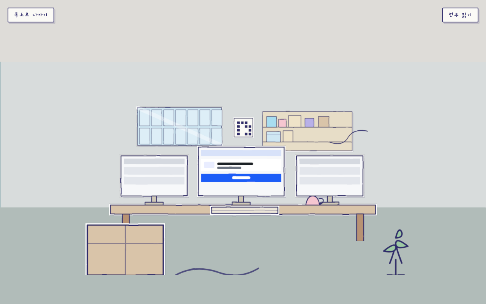
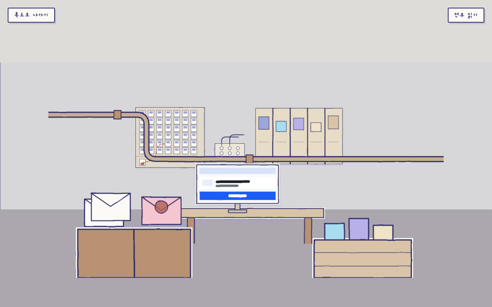
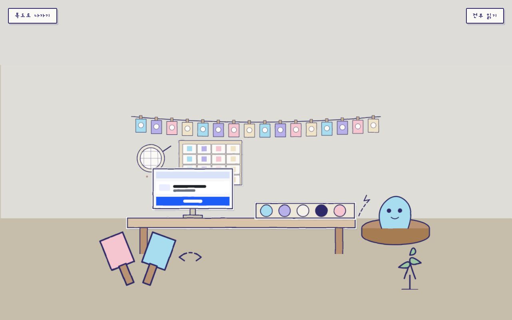
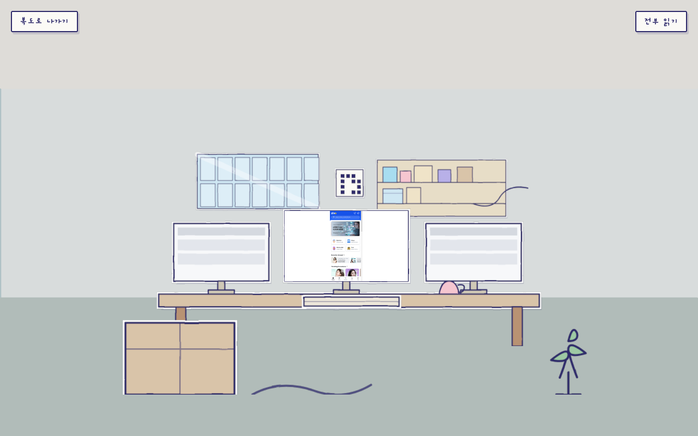
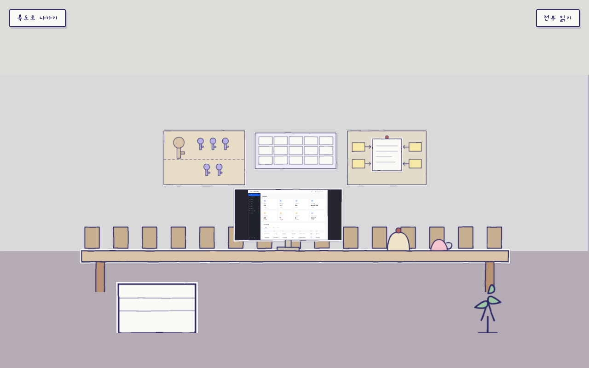
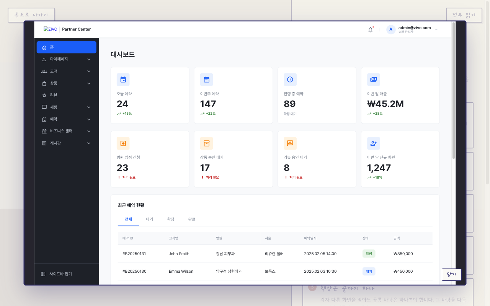
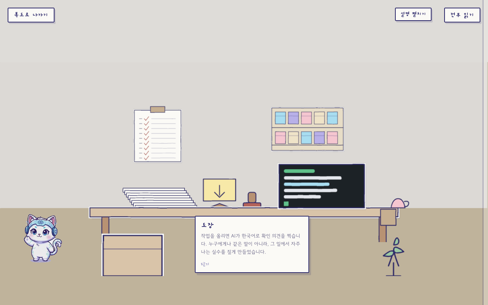

# 복도형 포트폴리오 — 세계 설계 기록

**시작**: 2026-08-20
**캔버스**: https://claude.ai/code/artifact/107c6475-644a-49b6-a979-f4e296eb00cb
**작업 파일**: `design/` (`Main.dc.html` · `PaperDiorama.dc.html` · `Editorial.dc.html` · `WebRoom.dc.html` · `canvas.json`)
**참고 분석**: [itomdev.com 분석](itomdev-analysis.md) — 구조만 참고, 디자인·텍스처·카피는 복제하지 않음

---

## 확정된 것

### 1. 방 구성 — 6방 (2026-08-20 결정)

복도 좌우 교차 배치. 순서는 **지금 하는 일 → 지난 일 → 만든 것 → 나눈 것**.
채용 담당이 앞의 세 방만 보고 나가도 ZIVO 3영역이 다 전달되도록 앞에 몰았습니다.

| # | 위치 | 방 | 은유 | 근거 (profile-content.md) | 동작 데모 |
|---|---|---|---|---|---|
| 1 | 좌 | 웹 작업실 | 창가 책상 · 모니터 3대 · **창틀 14칸** · QR 스티커 | ZIVO_FRONT 1,947커밋 98% · 14개 언어 | QR 주문·결제 실제 화면 |
| 2 | 우 | 운영 데스크 | 긴 공용 책상 · 의자 15 · 이름표 꽂이 · 열쇠 보드 | ZIVO_ADMIN 1,781커밋 68% · shared 713커밋 | 역할 바꾸면 메뉴 접히는 화면 |
| 3 | 좌 | 백엔드 구역 | 벽 타고 옆방으로 가는 배관 · 두꺼비집 43 · 봉투 상자 | ZIVO_BACK 1,512커밋 1위 · 쿠폰 118커밋 · 테스트 101건 · CB 43지점 | 쿠폰이 두 번 안 나가는 과정 |
| 4 | 우 | 지난 작업실 | 천 덮은 편집기 · 필름 릴 · 접은 삼각대 | 여기가게 2022–23 · AI 통역 2024–25 · Lossless Cut | 영상 업로드→변환 파이프라인 |
| 5 | 좌 | 아잉 공방 | 작업대의 스프라이트 시트 · 빨래집게에 걸린 표정 카드 16장 | 표정 16 · 액션 16 · 모션 6 · GLB 205kB | 표정·포즈 직접 교체 |
| 6 | 우 | 공유 책상 | 큰 나무 테이블 · 가져가라고 놓인 유인물 더미 · 회람판 | zivo-skills CLI · 스킬 10종 · PR 리뷰봇 | `npx zivo-skills` 도는 터미널 |

### 2. 데모 밀도 — 방당 살아 있는 것 하나 (2026-08-20 결정)

방 하나에 실제 동작 데모는 **딱 1개**. 나머지 화면은 WebP 정지 캡처.
6방을 다 지어도 저사양 기기가 버티게 하는 예산선입니다.

거리 3단계:

| 거리 | 상태 | 비용 |
|---|---|---|
| 멀리 (복도에서) | WebP 캡처 한 장 | 3D 오브젝트도 HTML도 없음 |
| 중간 (문 열고 들어서면) | HTML 레이어 페이드인 | 읽기·복사·확대 가능 |
| 가까이 (책상 앞) | 포인터 이벤트 ON | 실제 클릭·스크롤 |

### 3. 세계 규칙 3가지

1. **걸음이 곧 스크롤** — 휠·터치·드래그를 하나로 받아 카메라를 민다. 문 앞에서 카메라가 저절로 그쪽을 본다.
2. **글자는 3D에 넣지 않는다** — 3D는 공간·카메라·전환만. 읽는 글과 UI는 HTML로 남겨 검색·복사·확대·스크린리더가 그대로 된다.
3. **모델도 조명도 쓰지 않는다** — 모든 사물은 손으로 그린 평면. 그늘은 텍스처에 미리 칠한다. (itomdev 분석에서 확인된 가장 큰 성능 승리)

### 4. 핵심 대비 — 세계에서 모니터만 손그림이 아니다

손그림 세계 안에서 **모니터 화면만 또렷한 실제 UI**입니다.
눈이 자연히 그리로 가고, "그림 잘 그렸네"가 아니라 "이걸 만들었네"로 읽힙니다.
ZIVO_DESIGN의 실제 토큰(`--primary-color: #1A5DF7`, `--gray-900: #1E2128`)을 그대로 씁니다.

### 5. 팔레트 — 아잉 킷 기반

`mascot/aing-kit.json`에서:
ice `#A8DDF0` · lavender `#B8B0E8` · cream `#F4F1EA` · ink `#2E2A6B` · blush `#F5C6D0`

방별 색 배정: 웹 ice · 어드민 lavender · 백엔드 `#9DA6D8` · 지난작업 blush · 공방 `#EFE3C8` · 공유 `#D9C4A9`(따뜻한 나무)

---

## 시각 방향 — A 채택 (2026-08-21 결정)

**A(종이 디오라마)를 바탕으로, B의 지시선·절제된 활자를 이식.**

취향이 아니라 엔진 제약이 근거입니다. 이 세계는 조명 없는 평면들로 짓기로 했고(세계 규칙 3), A의 "오려 붙인 층"은 그 평면 구조와 1:1로 맞습니다. B의 단면도는 정지된 지면에서 성립하는 규약이라 걸어 들어가는 복도로 옮겨지지 않습니다. 아잉이 여섯 방 전부에 나오는 것도 B의 얇은 선과 계속 부딪힙니다.

A의 약점(귀엽고 가벼운 인상)은 B의 방식으로 눌렀습니다 — 포스트잇 대신 번호 지시선과 차분한 캡션.

### 비교표 (판단 근거)

| | A · 종이 디오라마 | B · 에디토리얼 일러스트 |
|---|---|---|
| 그리는 법 | 오려 붙인 층 · 흰 테두리 · 짙은 그림자 | 한 장으로 이은 단면도 · 빗금 음영 |
| 색 | 평평한 컬러 채움 | 잉크 선 위주 · 절제된 워시 |
| 타이포 | Gaegu + Gowun Dodum + Nanum Pen Script | Gowun Batang + IBM Plex Sans KR |
| 설명 방식 | 포스트잇 | 지시선 + 캡션 |
| 강점 | 손맛 강함 · 겹침만으로 깊이 (3D 모델 진짜 불필요) | 그림이 곧 문서 · 이력서 톤과 안 부딪힘 |
| 약점 | 귀엽고 가벼운 인상 — 9년차 무게는 글로 눌러야 함 | 얇은 선이 작은 화면에서 뭉갬 · 아잉의 둥근 인상과 톤 충돌 |

실제 채택안 = A의 종이 질감 + B의 지시선.

---

## 참고 자산 위치

| 자산 | 경로 | 쓸 곳 |
|---|---|---|
| ZIVO 앱 화면 40여 개 | `/Users/iron/Project/ZIVO/ZIVO_DESIGN/app/` | 웹 작업실 모니터 |
| ZIVO 어드민 화면 25여 개 | `.../ZIVO_DESIGN/admin/` | 운영 데스크 모니터 |
| ZIVO 디자인 토큰 | `.../app/design-system.css` (4,945줄) | 모니터 UI 정확도 |
| 아잉 컷아웃 38종 | `mascot/{expr,pose,motion}/` | 가이드 캐릭터 (포즈 35–50KB, 모션 400–600KB) |
| 아잉 3D | `mascot/3d/aing-lite.glb` (205kB) | 공방 회전대 |
| 여기가게 디자인 정책서 | `여기가게.pdf` (40MB) | 지난 작업실 |
| 전체 카피 원문 | `profile-content.md` | 모든 방 텍스트 |

---

## 다음 단계

1. ~~방향 A/B 확정~~ — A 채택 (2026-08-21)
2. ~~확정된 톤으로 6방 아트보드~~ — 완료 (2026-08-21)
3. ~~R3F 골격 — 복도 · 카메라 훅 · 문 진입/이탈~~ — 완료 (2026-08-21). **순서를 바꿨습니다**: 문서엔 텍스처가 3번이었지만, "텍스처 전에 사각형으로 메커니즘부터"가 맞습니다. 방향이 틀리면 텍스처를 다시 그려야 합니다.
4. ~~방 안 사물 배치 (아트보드를 3D 평면으로)~~ — 완료 (2026-08-21)
5. ← **지금 여기** 살아 있는 화면 하나씩 (ZIVO_DESIGN HTML 임베드)
6. 셰이더 사전 컴파일 · 디바이스 티어링 3단

---

## 리뷰 반영 기록 (2026-08-20)

`/code-review`가 헤드리스 크롬으로 실제 렌더 박스를 측정해 15건을 제기. 13건 수정, 2건은 다르게 처리.

### 근본 원인 1건 — 파생 결함 다수를 만듦

**카드 6개에 `box-sizing`이 없었음.** `width:240px; height:232px`에 padding 14/16 + border 2.5가 더해져 실제 279×267로 렌더 → 카드가 전부 문에서 +18.5px씩 밀리고, 부푼 하단이 아잉 라벨을 덮어 두 한글 문장이 겹쳐 읽혔음.

`*, *::before, *::after { box-sizing: border-box; }`를 네 파일 헬멧에 추가. 측정 결과 카드 중심이 문 위치와 정확히 일치:

| | 웹 | 어드민 | 백엔드 | 지난 | 공방 | 공유 |
|---|---|---|---|---|---|---|
| 문 x | 285 | 475 | 675 | 865 | 1065 | 1255 |
| 카드 중심 x | 285 | 475 | 675 | 865 | 1065 | 1255 |

(측정된 242×234는 `rotate(-0.5deg)`로 AABB가 부푼 값 — 실제 박스는 240×232)

### 나머지 수정

| 결함 | 조치 |
|---|---|
| 아잉 라벨이 카드1 캡션 위에 인쇄 | 라벨을 아잉 오른쪽 아래로 (250, 296) |
| Editorial 빗금 3종이 타일 가장자리 앵커 → 획 절반 잘려 50% 농도 | 타일 중앙 앵커 (`M 3 0 V 6` 등). B의 유일한 음영 장치라 방향 비교가 왜곡되고 있었음 |
| Editorial 마스코트가 모니터1·라이브 UI·책상다리·문 스윙호를 덮음 | 복도로 이동 (96, 341). 개념상으로도 맞고, A/B 둘 다 가림 없음 |
| "진짜 QR 결제 화면이 돌아감" 캡션이 선반 판자에 올라탐 | 지시선·글 20px 위로 → y174~189, 선반 y196. 7px 여유 |
| "어제도 누가 앉아 있었다는 표시"를 책상다리가 관통 | 도면 아래 여백으로 (684, 495~510). 다리 x820 밖 |
| PaperDiorama 포스트잇 글자가 노트 밖 21px 흘러넘침 | 노트 58×58 → 78×62, 글자 17px → 14px, "QR " 접두 제거. 6개 전부 노트 안 |
| WebRoom 배지 5·6이 가리키는 대상을 49%·80% 덮음 | 배지5 → (620,56) 선반 왼쪽 벽, 배지6 → (494,374) 책상 앞면 |
| Main 그레인이 헤더·푸터 위에만 얹히고 복도는 비껴감 | 컨테이너 마지막 자식 + `z-index:5`, 4옥타브 → 2옥타브 |
| Gaegu·Gowun Batang 400 웨이트 미사용 | 700만 요청 |
| 마스코트 4배 오버샘플 + 미참조 파일 2개 | 256px로 다운샘플 (94KB → 42KB), `aing-carry`·`aing-wave` 삭제 |
| Main "키캡 상자 열넷" vs 상세 3장 "창틀 열넷" 불일치 | 창틀로 통일. 상세 아트보드 전부가 창을 그리고 있었음 |

### 다르게 처리한 2건

**1. "옆방 백엔드로 이어짐"이 지시선에 취소선처럼 그어짐" — 오탐.**
리뷰는 1124px² 겹침을 보고했으나 이는 지시선의 *바운딩박스* 값. 실제 선분은 세로 x=868, 가로 y=268이고 캡션은 x880.3~978 / y282~313 — 두 축 모두 12~14px 여유. 획은 지나지 않음. 재측정으로 확인 후 미수정.

**2. `role="img"` + `aria-label`이 내부 캡션을 보조기기에서 가림 — 수정하되 범위는 다름.**
지적 자체는 정확. 다만 리뷰가 근거로 든 "world-rule #2 위반"은 성립하지 않음 — 그 규칙은 *배포될 사이트*의 텍스트에 대한 것이고 이건 목업 아트보드임. 그래도 캡션이 읽히지 않는 건 실제 손해라 네 파일 모두 `role="img"`/`aria-label`을 제거하고 `<title>`로 교체.

### 검증 방법

각 아트보드에서 `<x-dc>` 내용만 뽑아 독립 HTML로 만들고, `document.fonts.ready` 후 헤드리스 크롬에서 `getBoundingClientRect()`로 지적된 쌍만 정확히 측정. 최초 검사는 "포스트잇 글자가 제 포스트잇 위에 있음"을 30건 겹침으로 세는 오탐을 냈고, 대상 쌍을 한정해 재작성함.


---

## 여섯 방 아트보드 (2026-08-21)

캔버스를 페이지 둘로 나눴습니다.

- **복도와 규칙** — 조감도 · 방 작동 방식 · 방향 A(채택) · 방향 B(미채택, 기록용)
- **방 여섯** — 방 1~6 장면. 3열 × 2행.

### 여섯 방 공통 규칙

| 규칙 | 내용 |
|---|---|
| 살아 있는 화면은 방당 하나 | 콜아웃 6번, 파란 테두리. 나머지는 정지 캡처 |
| 숫자는 간판이 아니라 세어지는 사물 | 창틀 14 · 이름표 15 · 두꺼비집 43 · 릴 6칸 · 표정 16 · 상자 10 |
| 설명은 포스트잇이 아니라 번호 지시선 | B에서 이식한 부분 |
| 하단 근거 스트립 3칸 | 커밋·수치·일하는 방식 |

### 방별 은유와 근거

| 방 | 핵심 사물 | 살아 있는 화면 |
|---|---|---|
| 1 웹 작업실 | 창틀 14칸 · QR 스티커 · 라벨 상자 · 벽 넘는 케이블 | QR 주문·결제 |
| 2 운영 데스크 | 열쇠 보드(큰 것 1 + 작은 것 5) · 이름표 15칸 · 종이 한 장짜리 게시판 · 종 하나 | 역할 전환 → 메뉴 접힘 |
| 3 백엔드 구역 | 두꺼비집 43(하나 내려가고 우회선) · 봉투 상자 · 칸막이 갈린 선반 · 콘센트 3구 · 궤짝 | 쿠폰 발급 재시도 |
| 4 지난 작업실 | 필름 릴 3 · 6칸 스트립 · 가위표 친 파형 · 기울어진 저울 · 천 덮인 편집기 | 업로드→변환 경로 |
| 5 아잉 공방 | 빨랫줄 표정 16장 · 4×4 시트 · 물감 5칸 · 회전대 · 체 · 핑퐁 채 | 표정·포즈 교체 |
| 6 공유 책상 | 회람판(체크 9) · 스킬 상자 10칸 · 유인물 더미 · 도장 · 팻말 | npx 터미널 |

### 렌더 검사에서 잡아 고친 것

측정만으로는 안 잡히고 실제 렌더를 봐야 나온 문제들입니다.

| 문제 | 조치 |
|---|---|
| 모든 가구 다리가 바닥선에 딱 붙어 장면이 납작함 | 다리를 바닥 안쪽(y≈480)까지 내려 접지. 여섯 방 전부 |
| 하단 스트립 `margin-top:auto`가 가운데 160px 구멍을 만듦 | 프레임 920 → 860으로 줄여 해소 |
| 백엔드: 모니터가 봉투 상자를 통째로 덮어 핵심 은유가 안 보임 | 봉투 상자를 왼쪽 바닥으로, 봉투가 위로 솟게. 모니터는 새 책상 위로 |
| 백엔드: 궤짝이 평범한 박스라 "묶음"으로 안 읽힘 | 오른쪽 바닥으로 옮기고 슬랫 + 내용물 3개 |
| 공유: 터미널이 스킬 상자 3개를 가려 "열 칸"이 안 세어짐 | 선반을 위로(y50–190), 터미널을 책상 위로(y204). 10칸 전부 보임 |
| 공유: 의자가 책상 아래 블록으로 보임 | 등받이를 책상 위로 올림 |

프레임 높이는 헤드리스 크롬으로 콘텐츠 높이를 재서 정했습니다 — 콜아웃 6칸이 든 오른쪽 단이 항상 장면보다 길어서, 그 단이 높이를 결정합니다.


---

## R3F 골격 (2026-08-21)

**메커니즘 우선.** 텍스처 없이 색칠한 평면만으로 복도가 걸어지고 방에 들어가지는 상태까지 만들었습니다.

### 스택

Next.js 16.3.1 (App Router) · React 19.2.8 · @react-three/fiber 9.7 · three 0.185 · GSAP 3.15

Vite가 아니라 Next를 고른 이유는 **세계 규칙 2**입니다. 읽는 글이 서버에서 렌더돼야 크롤러와 에이전트가 읽습니다.
기존 사이트(`psw/3d-web-profile`)도 Next 16이라 스택이 맞습니다.

### 파일 (총 1,152줄)

| 파일 | 줄 | 역할 |
|---|---:|---|
| `lib/rooms.ts` | 189 | 여섯 방 정본. 3D 배치와 HTML 본문이 같은 데이터를 씀 |
| `components/world/useCorridorCamera.ts` | 163 | 걸음 · 시선 전환 · 패럴랙스 · 키보드 · 제어권 위임 |
| `components/world/Scene.tsx` | 242 | 복도 평면 · 문 · 방 상자 · 근접 감지 |
| `components/world/WorldShell.tsx` | 78 | Canvas + DOM 오버레이 + 읽기 모드 |
| `app/page.tsx` | 81 | 서버 컴포넌트. 본문 전체를 HTML로 렌더 |
| `app/globals.css` | 383 | 팔레트 · 복도 모드 / 읽기 모드 |

### 세계 규칙이 코드에서 지켜지는 방식

| 규칙 | 구현 |
|---|---|
| 걸음이 곧 스크롤 | GSAP `Observer`(wheel·touch·pointer 통합) → `targetZ` → 프레임레이트 독립 감쇠 |
| 문 앞에서 저절로 고개 돌기 | `START 16 → PEAK 7 → END -2` 구간, easeOutQuad. 최대 시선은 문 **7유닛 앞**에서 |
| 글자는 3D에 안 넣음 | 본문 전체가 `app/page.tsx` 서버 렌더. 3D는 언제 보여줄지만 결정 |
| 모델도 조명도 안 씀 | `meshBasicMaterial`만. 왼쪽 벽 밝게 / 오른쪽 벽 어둡게 칠해 방향감을 만듦 |
| 색칠되면 누를 수 있음 | 문은 회색 스케치 → 호버 시 방 색으로 `Color.lerp` |

### 접근성

- 방향키 · PageUp/Down · 스페이스로 복도를 끝까지 갈 수 있음
- 문 앞 프롬프트와 들어가기/나가기는 실제 `<button>` — 3D 안이 아니라 DOM
- **전부 읽기** 모드: 캔버스를 언마운트하고 여섯 방을 한 문서로 폄 (6,402px)
- `prefers-reduced-motion`에서 패널 트랜지션 제거

### 실기기에서 만질 손잡이

`useCorridorCamera.ts`의 `FEEL` 상수. 휠 한 칸, 손가락 관성, 트랙패드가 기기마다 달라 코드에서 뺐습니다.

```
speed 0.022   입력 1px당 전진 유닛
damp  4.2     위치 추적 감쇠
keyStep 7     방향키 한 번
parallax 0.06 마우스 최대 각
```

### 브라우저로 몰아서 잡은 것들

측정이 아니라 **실제로 걸어 봐야** 나온 문제들입니다.

| 증상 | 원인 | 조치 |
|---|---|---|
| 캔버스가 통째로 비어 보임 | 벽·바닥 색이 배경색과 거의 같았음. 기하는 처음부터 있었음 | 음영을 색값에 제대로 칠함 (`#C6B598` 바닥 / 좌우 벽 명암차) |
| 복도가 홀처럼 보임 | 폭 7 · 높이 4.2 | 폭 4.8 · 높이 3.4 |
| 끝까지 걸으면 화면이 빔 | 걷기 한계와 끝벽이 같은 z(-96) — 카메라가 벽과 동일 평면에 섬 | `walkEndZ: -90`을 `endZ`와 분리 |
| **방에서 나온 뒤 영영 안 걸어짐** | `timeline({onComplete: A})`에 `.eventCallback('onComplete', B)`를 걸어 **A가 통째로 사라짐**. 제어권 반환 코드가 A에 있었음 | `enter/exit(room, onDone)`으로 콜백을 인자로 받게 바꿈 |
| 문이 실오라기로 보임 | 벽에 붙은 평면이라 정면에서 거의 edge-on | 문틀을 벽 안쪽으로 파묻고, 시선 전환 폭 0.34 → 0.44 |

마지막 것이 이번의 진짜 버그입니다. 스크린샷이나 박스 측정으로는 안 잡히고, 여섯 방을 실제로 들어갔다 나와 봐야 드러납니다.

### 검증

여섯 방을 순서대로 걸어가 진입·이탈 왕복 — 전부 통과.

| 방 | 진입 | 나온 뒤 |
|---|---|---|
| 웹 작업실 | `web` | null |
| 운영 데스크 | `admin` | null |
| 백엔드 구역 | `backend` | null |
| 지난 작업실 | `past` | null |
| 아잉 공방 | `workshop` | null |
| 공유 책상 | `shared` | null |

서버 렌더 HTML에 여섯 방 본문이 전부 들어 있는 것도 확인 (JS 없이 `curl`로 검사).

### 아직 빈 것

방 안은 색칠한 빈 상자입니다. 사물은 다음 단계에서 아트보드를 평면으로 옮기며 채웁니다.

---

## 리뷰 반영 — R3F 골격 (2026-08-21)

`/code-review`가 15건 제기. **14건 적용, 1건은 다른 방식으로 처리.**

### 치명적 3건

**1. 방 안에서 읽기 모드를 켰다 끄면 복도가 영구히 잠김**
`{!reading && <Canvas>}`로 캔버스를 언마운트하면 Scene의 `activeRef`가 사라지는데 `activeId`는 남습니다.
돌아오면 `exit()`가 가드에서 early-return → 나가기·Esc 무반응, 모든 문 `locked` → 클릭도 색칠도 안 됨, 프롬프트도 억제.
새로고침 말고는 복구 불가.
→ **캔버스를 언마운트하지 않습니다.** `frameloop={paused ? 'never' : 'always'}`로 세우고 CSS로 가립니다.
GL 컨텍스트·컴파일된 셰이더를 버렸다 다시 만드는 비용도 같이 사라집니다. `activeId`에서 `activeRef`를 재동기화하는 이펙트도 추가.

**2. 방 본문이 첫 화면 아래로 스크롤이 안 됨**
GSAP `Observer`의 `preventDefault: true`는 콜백 전에 무조건 `e.preventDefault()`를 부릅니다(`Observer.js`의 `_onWheel`/`_onDrag`).
방 패널은 `overflow-y: auto`에 콜아웃 6 + 근거 3이라 화면보다 457px 넘칩니다. **읽으라고 만든 글의 절반이 닿지 않았습니다.**
→ `preventDefault: false`로 바꾸고, 페이지 스크롤은 `overscroll-behavior: none`으로 막습니다.
대신 `.doc` 위에서 굴린 휠은 카메라를 안 밀도록 콜백에서 걸러 냅니다 — 글을 읽는 동작이지 걷는 동작이 아니니까요.

**3. 연락처가 복도 경로에서 영영 안 보임**
`.doc > *`를 전부 숨기고 표지와 방 여섯만 여는 규칙을 뒀는데, `colophon`은 어느 쪽에도 안 맞았습니다.
복도를 끝까지 걷고 방을 다 들어갔다 나와도 메일·GitHub·YouTube에 닿지 못했습니다. **연락받는 게 목적인 사이트에서 CTA가 도달 불가.**
→ 복도 끝(`walkEndZ + 5`)에 닿으면 콜로폰이 열립니다. 걸어서만 가도 도착합니다.

### 나머지 11건

| 결함 | 조치 |
|---|---|
| 방에서 나온 뒤 들어가기 버튼이 안 뜸 (`near.current`가 안 풀림) | 진입·이탈 완료 시 `near.current = null` |
| 진행 중 비행을 안 죽여 사라진 카메라를 계속 굴림 | `flight` ref에 담고 cleanup에서 `kill()` |
| 포커스된 버튼 위 스페이스를 전역 핸들러가 가로챔 | `isInteractiveTarget()` 가드 — 키보드 사용자가 버튼을 못 누르던 문제 |
| Enter가 버튼 활성화와 전역 핸들러에 동시 발화 | 같은 가드 |
| `prefers-reduced-motion`을 CSS 페이드에만 적용 | 0.35s 페이드만 끄고 1인칭 돌리·±0.44rad 고개 돌리기·1.65s 진입 비행은 그대로였음. `lib/anim.ts`에서 읽어 회전을 0으로, 비행을 컷으로 |
| CSS에 방 id 6개를 박아 둠 (두 번째 정본) | `[data-open]` 하나로. 여는 절은 `ROOMS`에서 계산해 JS가 속성으로 표시. `aria-hidden`도 같이 붙음 |
| 복도 벽과 방 사이 3.6유닛 빈 공간 | `roomOffset` 15 → 11.4로 방을 벽에 붙이고, 복도 벽을 `DoubleSide`로 (단면이면 방 쪽에서 뻥 뚫려 보임) |
| three가 정적 import + 토글마다 GL 컨텍스트 재생성 | `next/dynamic({ssr:false})`로 `World` 분리 + 캔버스 상주 |
| `damp` 헬퍼가 두 파일에 복붙 | `lib/anim.ts`로 통합 |
| `roomById` 재구현, 카메라 상수 하드코딩 | `roomById()` 사용, `CORRIDOR.eye/startZ` 참조 |
| 문 6개가 각자 `document.body.style.cursor`를 씀 | Scene 한 곳으로 올림 (교차 호버에서 어긋나던 문제) |

### 다르게 처리한 1건 — Google Fonts

지적(@import가 `globals.css` 파싱 뒤에야 시작돼 폰트가 두 홉 뒤로 밀림)은 정확합니다.
다만 제안된 `next/font`는 이 서체들에 **못 씁니다** — Gaegu·Gowun Dodum·Nanum Pen Script의 타입 정의가 `latin`만 노출합니다:

```
Type '"korean"' is not assignable to type '"latin"'.
```

`latin`만 받으면 한글이 폴백(Apple SD Gothic Neo)으로 떨어져 손글씨 인상이 통째로 사라집니다. 고치려다 더 크게 부수는 셈입니다.
→ **문제의 핵심만 취했습니다.** `<head>`의 `<link>` + `preconnect`로 옮겨 직렬화를 없애고, 한글 글리프는 지킵니다.

### 검증 (헤드리스 크롬, 실제 조작)

| 항목 | 결과 |
|---|---|
| 방 안에서 읽기 모드 왕복 → 탈출 | 성공 (예전엔 영구 잠김) |
| 나온 직후 들어가기 버튼 | `웹 작업실` 재등장 |
| 휠에 preventDefault 걸림 | `false` — 네이티브 스크롤 살아남 |
| 패널 넘침 / 스크롤 | 457px / 이동 확인 |
| 패널 위 휠이 복도를 미는가 | 안 밈 |
| 복도 끝 | `colophon` 열림, mailto 링크 존재 |
| 빈 곳 스페이스 | 걸어짐 |
| 포커스된 버튼 위 스페이스 | 안 걸어짐 |

`tsc --noEmit` 통과. 총 1,327줄 (파일 9개).

---

## 방 안 사물 (2026-08-21)

아트보드에서 그린 물건을 방 안 평면으로 옮겼습니다. 빈 상자였던 방 여섯이 채워졌습니다.





### 구조 — 방 하나 = 깊이가 다른 층 셋

"오려 붙인 층"을 그대로 세웠습니다. 방향 A를 고른 근거(평면 구조와 1:1로 맞음)가 여기서 실제로 쓰입니다.

| 층 | 깊이 | 들어가는 것 |
|---|---|---|
| back | 0.97 (+0.72 올림) | 벽에 붙은 것 — 창 · 선반 · 게시판 · 두꺼비집 · 빨랫줄 |
| mid | 0.62 | 가구 — 책상 · 작업대 · 배관 · 모니터 |
| front | 0.45 | 앞쪽 소품 — 상자 · 봉투 · 궤짝 · 삼각대 · 화분 |

깊이는 **카메라가 서는 자리(0)에서 안쪽 벽(1)까지의 비율**입니다. 방 중심 기준으로 잡으면 앞 층이 카메라 등 뒤로 넘어갑니다.

### 방식 — SVG를 데이터 URI 텍스처로

`lib/props.ts`에 SVG 문자열로 그리고, `TextureLoader`가 데이터 URI로 읽어 평면에 입힙니다.
파일도 빌드 단계도 없습니다. `width/height`를 `viewBox`의 2배로 두어 좌표는 그대로 두고 래스터만 촘촘하게 했습니다.

공용 조각: `cut()`(흰 테두리 + 짙은 그림자 = 오린 종이) · `table()` · `grid()`(세어지는 물건) · `plant()` · `mug()` · `monitor()` · `liveScreen()`.
`liveScreen`만 ZIVO 실제 토큰(`#1A5DF7`)을 씁니다 — **세계에서 모니터 화면만 손그림이 아니다**는 규칙이 코드에서 지켜집니다.

### 세어지는 사물

| 방 | 세어지는 것 |
|---|---|
| 웹 작업실 | 창틀 14칸 (7×2) · QR 스티커 · 라벨 상자 · 벽 넘는 케이블 |
| 운영 데스크 | 큰 열쇠 1 + 작은 열쇠 5 · 이름표 15칸 (5×3) · 의자 15 · 종이 한 장 게시판 |
| 백엔드 구역 | 두꺼비집 43 (7×6 + 1, 그 하나가 내려가고 우회선) · 칸막이 5칸 · 콘센트 3구 |
| 지난 작업실 | 필름 릴 3 · 스트립 6칸 · 가위표 친 구간 · 기울어진 저울 |
| 아잉 공방 | 표정 카드 16장 · 4×4 시트 · 물감 5칸 · 회전대 · 체 · 핑퐁 채 |
| 공유 책상 | 회람판 체크 9 · 상자 10칸 (5×2) · 유인물 9장 |

### 눈으로 보고 되돌린 것들

계산은 맞는데 화면이 틀린 경우가 반복됐습니다. 전부 렌더를 보고 고쳤습니다.

| 증상 | 원인 | 조치 |
|---|---|---|
| 층이 안쪽 벽까지 못 감 | 카메라가 보는 깊이를 `roomD`(z, 14)로 계산. 실제 깊이는 `roomW`(x) | 축 교체 |
| 앞 층 물건이 거대하게 잘림 | 앞 층이 카메라에서 2유닛. 평면 폭(14)이 방 깊이보다 넓음 | 방 깊이 18→9, 평면 폭 7 고정, 앞 층 0.30→0.45 |
| 컵이 공중에 뜨고 작아짐 | 거리 비례로 평면을 키웠더니 **층 간 실척 관계가 깨짐** | 전 층 같은 실척(7×2.5)으로 되돌림 |
| 컵이 여전히 허공에 | 앞 층엔 책상이 없는데 책상 높이에 그림 | 컵을 중간 층 책상 위로 (방 1·2·6) |
| 창과 선반이 모니터에 가림 | 벽에 붙는 것과 가구가 같은 높이 | 벽 층에 `lift: 0.72` |
| 회전대가 공중에 | 바닥에 서는 물건인데 벽 층에 있었음 | 중간 층으로 |
| 앞 층 소품이 화면 밖으로 | 가장자리(x 96, 1006)에 그림. 가까운 층은 화각이 좁음 | 24곳을 안쪽으로 |

### 검증

여섯 방 진입·이탈 왕복 + 복도 끝 — 전부 통과. `tsc --noEmit` 깨끗.

| 방 | 진입 | 나온 뒤 |
|---|---|---|
| 웹 작업실 · 운영 데스크 · 백엔드 구역 | `web` · `admin` · `backend` | `cover` |
| 지난 작업실 · 아잉 공방 · 공유 책상 | `past` · `workshop` · `shared` | `cover` |
| 복도 끝 | — | `colophon` |

총 1,839줄 (파일 10개).

### 아직 남은 것

- 벽 윗부분이 비어 있음 — 방 높이 4.2에 층 높이 2.5
- 살아 있는 화면이 아직 그림입니다. ZIVO_DESIGN HTML을 실제로 임베드하는 건 다음 단계
- 셰이더 사전 컴파일 · 디바이스 티어링 3단

---

## 살아 있는 화면 (2026-08-21)

**세계에서 모니터 화면만 손그림이 아니다** — 이 규칙이 이제 말이 아니라 사실입니다.
손으로 그린 방 안에서 진짜 ZIVO 화면이 돌아가고, 눌러 볼 수 있습니다.





### 방식 — 3D 자리를 화면 좌표로 투영하고 iframe을 앉힌다

방에 들어가면 카메라가 문을 정면으로 보고 **완전히 멈춥니다**(`overridden` 동안 패럴랙스도 꺼짐).
그래서 매 프레임 따라다닐 필요 없이, 도착했을 때 한 번만 계산하면 됩니다.
평면이 정면이라 투영된 사각형도 축에 정렬되어 두 꼭짓점만 재면 충분합니다.

```
SVG 좌표 (1120x400)
  → 평면 로컬 (u,v,0)      u = (px/1120 - 0.5) * w,  v = (0.5 - py/400) * h
  → mesh.localToWorld()
  → camera.project()
  → 화면 px
```

`lib/props.ts`의 층에 `live: { x, y, w, h, src, vw, vh, label }`을 적으면 그 자리에 iframe이 앉습니다.
SVG에 그려 둔 화면 그림은 iframe이 뜨기 전까지 보이는 자리표시로 남습니다.

`vw`/`vh`는 **그 페이지가 상정한 화면 크기**입니다. 자리 크기에 맞춰 늘리면 원래 설계한 배치가 무너지므로,
그 크기로 렌더한 뒤 `transform: scale()`로 줄입니다.

### 지금 살아 있는 것

| 방 | 화면 | 논리 크기 |
|---|---|---|
| 웹 작업실 | 손님이 쓰는 앱 첫 화면 | 390 × 844 (세로) |
| 운영 데스크 | 운영자가 쓰는 관리 화면 | 1440 × 900 (가로) |
| 나머지 넷 | 아직 SVG 그림 | — |

백엔드·지난작업·공방·공유의 데모는 ZIVO 화면이 아니라 직접 만들어야 하는 것들입니다
(쿠폰 발급 과정, 영상 변환 경로, 표정 교체, 터미널). 다음 단계입니다.

### 에셋

`public/zivo/` — 2.7MB · 파일 57개.
참조를 따라가며 필요한 것만 복사하고 이미지는 480px로 줄였습니다 (8.4MB → 2.4MB).
복사되지 않은 다른 섹션으로 나가는 링크는 `#`으로 바꿔 데모 안에 머물게 했습니다.

### 크게 보기

1440px 화면을 230px 모니터에 넣으면 글씨를 못 읽습니다.
증거로 보여 주는 화면이 정작 증거 노릇을 못 하므로, 눌러서 화면의 90%로 키울 수 있게 했습니다.
Esc는 확대를 먼저 닫고, 한 번 더 누르면 방을 나갑니다.

### 막혔던 것

| 증상 | 원인 |
|---|---|
| `common.js` 404 | HTML이 `../common.js`를 참조. `/zivo/app/`에 넣었지만 실제 요청은 `/zivo/common.js` |
| 하단 네비 아이콘 5개 404 | HTML에 없고 `common.js`가 런타임에 경로를 조립. 정적 참조 추적으로는 안 잡힘 |
| 어드민 로고 깨짐 | 같은 이유 — `header.js`가 삽입 |
| 함수 블록 중복 | 파일 안에서 `PropLayer`가 `RoomBox`보다 **뒤**에 있는데 앞이라고 가정하고 잘라 붙임 |

정적 참조만 훑어서는 부족했습니다. 런타임에 조립되는 경로는 JS를 읽어야 나옵니다.

---

## PDF 포트폴리오 반영 (2026-08-21)

`PARK_SANGWOOK_PORTFOLIO.pdf`(19쪽)를 읽고, 제가 앞서 지적했던 **구조 불균형의 답**을 거기서 가져왔습니다.

### 무엇이 있었나

PDF는 커리어를 4단으로 정리해 두고 있었습니다 — **`SI · PRODUCT · FULL-STACK · AI-NATIVE`**.
사이트는 마지막 단계(ZIVO 아홉 달)만 담고 있었고 앞의 6년이 거의 비어 있었습니다.

| 시기 | 회사 | 내용 |
|---|---|---|
| 2019.09 – 2022.04 | 아와소프트 | 한국도로공사 도로관제 · KT 물류 IoT · 지닥 세무 시스템 (4~7인 SI) |
| 2022.06 – 2023.11 | 데브락 | 여기가게 숏폼 앱 · 파트너스 웹 (2인 풀스택) |
| 2024.01 – 2025.03 | 애자일그로스 | Motivr 1인 풀스택 · AI Interpreter · QUICKMOTION NFT |
| 2025.10 – 2026.07 | ZIVO | 웹 · 어드민 · 백엔드 |

### 어떻게 넣었나 — 방을 새로 만들지 않고

`지난 작업실`이 영상·오디오만 담고 있었는데, **필름 릴이 마침 셋**이었습니다.
그림을 하나도 고치지 않고 릴 셋을 "ZIVO 앞의 세 회사"로 다시 읽었습니다.

| 사물 | 전 | 후 |
|---|---|---|
| 필름 릴 3 | (그냥 릴) | 릴이 셋인 이유 — 지금 회사 앞의 세 곳 |
| 첫 릴 | — | 한국도로공사 · KT · 가상자산 거래소 세무 시스템 |
| 6칸 스트립 | 영상 파이프라인 | 그대로 (여기가게) |
| 가위표 친 구간 | 늦게 온 음성 | 그대로 (실시간 통역) |
| 삼각대 | FFmpeg 직접 수정 | 서버부터 화면까지 혼자 세워 본 경험 (Motivr) |

방 이름·배치·사물을 하나도 안 건드리고 카피만 다시 썼습니다.

### AI 축을 되살림

PDF에는 AI가 큰 축인데(에이전트 스킬 CLI · PR 자동 리뷰 · AI 쓰는 방식 한 쪽 전체) 사이트에는 거의 없었습니다.
`공유 책상`의 킥커를 **"AI를 일에 끼워 넣어 팀의 반복을 줄인 자리"**로 바꾸고,
도장 콜아웃에 AI가 리뷰를 쓴다는 사실을 명시했습니다.

근거 칸 하나는 PDF의 정직한 문장을 그대로 옮겼습니다 —
**"AI가 대신 썼다고 말하지 않습니다. 규칙과 금지사항을 먼저 정하고, 실제로 돌아가는지 확인한 뒤에 받아들입니다."**
인사팀이 읽었을 때 이 문장이 다른 지원자와 갈리는 지점입니다.

### 첫 화면

아홉 달이 아니라 여섯 해로 다시 잡았습니다.
`도로공사·KT 같은 큰 시스템에서 시작해, 앱과 영상 서비스를 만들고, 지금은 화면부터 서버까지 혼자 이을 수 있습니다.`

### 아직 안 쓴 것

PDF에는 이 사이트에 아직 없는 재료가 더 있습니다.

- WebGPU 파티클 검색창 · 온디바이스 LLM 질의응답 (앞 버전 사이트의 핵심)
- AEO — 에이전트가 JS 없이 읽는 이력서 (`Accept: text/markdown`, robots 16종 명시 허용)
- 3D 모델 54.44MB → 1.19MB · 초기 번들 185KB gzip
- 각 프로젝트의 문제 → 판단(버린 대안 포함) → 구현 → 결과 4단 구조

특히 **"버린 대안"**이 PDF의 강점입니다(쿠키 locale 대신 URL locale, StyleX 대신 vanilla-extract).
지금 사이트는 결과만 말하고 무엇을 버렸는지는 말하지 않습니다.

---

## 사물이 눌리고, 아잉이 움직입니다 (2026-08-21)



### 아잉이 왜 안 보였나

아트보드에만 있었고 3D 방에는 한 번도 안 들어갔습니다. 넣으면서 두 가지가 걸렸습니다.

**알파가 완전 이진이었습니다.** `pose/*.webp`의 알파 히스토그램을 재 보니 **중간값이 0** —
모든 픽셀이 완전 불투명 아니면 완전 투명이라, 부드러운 가장자리가 없습니다.
밝은 얼굴색이 경계에서 잘려 "누끼 딴 것처럼" 보였습니다.

→ **DOM ``로 옮겼습니다.** 3D는 설 자리만 잡고 그림은 브라우저가 그립니다.
   `motion/*.webp`(58프레임)를 쓰니 **실제로 움직이고**, 브라우저 스케일링이 가장자리를 부드럽게 처리합니다.

| 방 | 동작 |
|---|---|
| 웹 작업실 | `type` — 책상에서 타자 |
| 운영 데스크 · 백엔드 구역 | `think` — 고민 |
| 지난 작업실 | `idle` |
| 아잉 공방 | `celebrate` |
| 공유 책상 | `wave` — 가져가라고 손짓 |

자리는 **사물과 같은 SVG 좌표(1120×400)**로 잡습니다. 월드 유닛으로 잡으면 층 깊이에 따라
배율이 달라져 그림과 어긋납니다 (실제로 첫 시도에서 백엔드 아잉이 두꺼비집 반대편에 섰습니다).

### 사물마다 고유 동작

층 텍스처에 구워 두면 개별로 못 움직입니다. **29개 사물을 층에서 떼어 제 평면을 줬습니다.**

회전이 제 중심에서 돌도록, 바깥 `group`이 층의 방향을 잡고 안쪽 `mesh`만 제자리에서 움직입니다.

| 동작 | 어떤 사물 | 무엇을 하나 |
|---|---|---|
| `flutter` | 창틀 · 이름표 · 게시판 · 유인물 · 빨랫줄 · 시트 · 회람판 · 필름 스트립 | 종이가 펄럭 |
| `shake` | 선반 · 종 · 봉투 상자 · 궤짝 · 상자 열 칸 | 덜컹 |
| `swing` | 열쇠 보드 · 삼각대 · 팻말 | 매달린 것이 흔들림 |
| `spin` | 필름 릴 · 회전대 · 체 | 한 바퀴 |
| `press` | QR 스티커 · 두꺼비집 · 도장 | 눌리고 되돌아옴 |
| `tilt` | 컵 · 물감 · 저울 | 기울었다 돌아옴 |
| `ripple` | 케이블 · 콘센트 · 파형 | 선을 타고 물결 |

누르면 그 자리 옆에 설명이 붙습니다. 설명 정본은 `lib/rooms.ts`의 콜아웃이라
사물과 글이 갈라지지 않습니다 (`callout: n`으로 참조).

### 오른쪽 패널 접기

방 안에서 설명 패널이 화면 절반을 먹어 사물이 안 보였습니다. **설명 접기** 버튼을 달았습니다.

### 검증

여섯 방을 걸어 들어가 캔버스를 격자로 훑었습니다 — **29개 전부 눌리고 설명이 뜹니다.**

| 방 | 눌리는 사물 |
|---|---:|
| 웹 작업실 · 백엔드 구역 · 지난 작업실 · 아잉 공방 · 공유 책상 | 각 5 |
| 운영 데스크 | 4 |

### 같이 고친 리뷰 지적

| 지적 | 조치 |
|---|---|
| 네 방이 "살아 있음"이라 써 놓고 실제로는 그림 | 그 표시를 뗐습니다. 살아 있는 화면은 웹·어드민 둘뿐입니다 |
| 저울 그림은 있는데 아무도 안 가리킴 | 콜아웃을 되살렸습니다 |
| 같은 방에서 "둘이서 만든 곳" vs "혼자 이었습니다" 모순 | 둘이서 만든 앱에서 제가 맡은 구간으로 |
| "그 전 여섯 해"가 실제(5년 5개월)보다 과장 | 다섯 해로 |
| 유일한 제3자 목소리("돌아온 말")를 지웠음 | 되살렸습니다. 나머지 열여덟은 전부 자기 주장이라 |
| 첫 화면의 "아홉 달"에 선행어가 없음 | 리드에 다시 넣었습니다 |
| 공유 책상 킥커가 AI를 말하는데 근거가 없음 | 상자 열 칸이 AI 도구용이라는 사실을 본문에 넣었습니다 |
